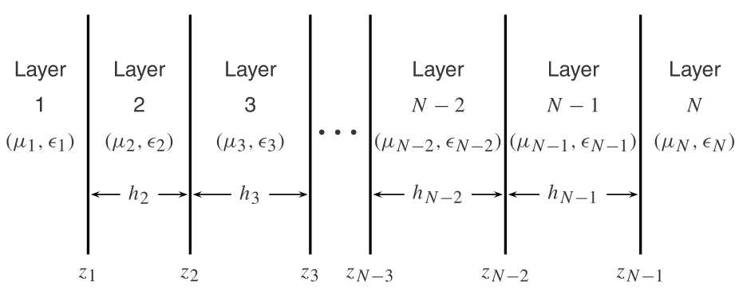
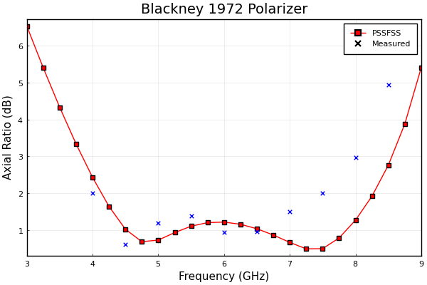
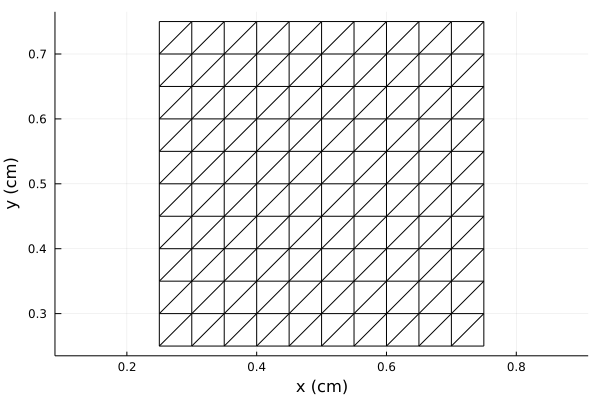
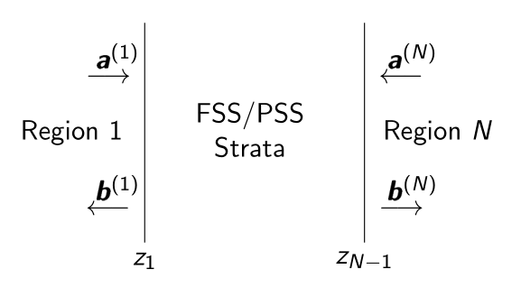

```@meta
EditURL = "<unknown>/manual.jl"
```

# [PSSFSS](https://github.com/simonp0420/PSSFSS) User Manual
## Introduction

### What Does PSSFSS Do?
PSSFSS analyzes a multilayered structure as shown below that is
stratified in the ``z`` direction
and infinite in extent in the ``x`` and ``y`` directions:



There are ``N \ge 2`` dielectric layers. The ``k``th layer is
characterized by its complex permittivity ``\epsilon_k``, complex
permeability ``\mu_k``, and width ``h_k`` (except for outer layers ``1`` and ``N``
which are assumed to be semi-infinite).  There are ``N-1`` junction planes
separating the layers. At some of these junction planes there may exist
frequency selective surfaces (FSSs) or polarization selective surfaces (PSSs)
consisting of zero-thickness periodic patterns of metallization.
PSSFSS will determine the generalized scattering matrix (GSM) for this structure
which fully characterizes it in terms of illumination by an incoming plane wave
of arbitrary polarization incident from either Region ``1`` or Region ``N``.

### A Quick Example
Here is an example run of PSSFSS for a 4-sheet meanderline polarizer design
from one of the first papers on the subject: T. L. Blackney, J. R. Burnett, and
S. B. Cohn, “A design method for meander-line circular polarizers”
presented at 22nd Annual Antenna Symposium, Oct. 1972.
Detailed explanations of the code are omitted for now.

```julia
using PSSFSS
outersheet = meander(a=0.3535, b=0.707, h=0.28, w1=0.018,
                     w2=0.018, ntri=800, units=inch,rot=45)
innersheet = meander(a=0.3535, b=0.707, h=0.37, w1=0.027,
                     w2=0.027, ntri=800, units=inch,rot=45)
flist = 3:0.25:9
steering = (ϕ=0, θ=0)
substrate = Layer(ϵᵣ=2.52, width=0.01inch)
spacer(width) = Layer(width=width, ϵᵣ=1.08)
strata = [  Layer(),
            outersheet, substrate, spacer(0.2inch),
            innersheet, substrate, spacer(0.3inch),
            innersheet, substrate, spacer(0.2inch),
            outersheet, substrate,
            Layer()  ]
outputs = ["blackney.csv"  @outputs FGHz ar21db(h)]
results = analyze(strata, flist, steering, outlist=outputs)
```

Assuming that the above code is contained in the file "blackney.jl"
it can be run from the Julia prompt via `include("blackney.jl")`,
after which a CSV file "blackney.csv" is
created, containing the frequency in GHz in the first column and
axial ratio in dB in the second. It can be plotted in Julia as follows:
```julia
using Plots, DelimitedFiles

p = plot(title="Blackney 1972 Polarizer", xlabel="Frequency (GHz)",
                                          ylabel="Axial Ratio (dB)")
data = readdlm("blackney.csv", ',', skipstart=1)
plot!(p, data[:,1],data[:,2],shape=:square,color=:red,label="PSSFSS")
dat = readdlm("blackney_ar_digitized.csv", ',')
scatter!(p, dat[:,1],dat[:,2],color=:blue,shape=:x,label="Measured")
display(p)
```

Note that we also graphed the measured results digitized from the plot
presented in the paper. Here is the comparison plot:



The PSSFSS run took about 30 seconds on my machine for 4 meanderline PSS sheets
analyzed at 25 frequencies.

I hope this example whetted your appetite to learn
more about PSSFSS!

### Recommendations for Hardware and Software

[PSSFSS](https://github.com/simonp0420/PSSFSS) is
written in the [Julia](https://julialang.org/) programming language.
You must have Julia installed to use PSSFSS.
For Windows users, I recommend using the [Chocolatey](https://chocolatey.org/) package manager to
handle the Julia installation.  For Linux and Mac users, I recommend using
[JILL.py](https://github.com/johnnychen94/jill.py) to manage the installation.

It goes without saying that computational electromagnetics is compute intensive. You will
want to run PSSFSS on a rather "beefy" machine. A machine with multiple cores
will provide the best experience since the code is multi-threaded.
Also, PSSFSS can use a lot of RAM--a minimum of 16 GBytes RAM is recommended.
The examples provided in this documentation were run on either a Windows or Linux machine,
both equipped with an
8-core Intel(R) Core(TM) i7-9700 processor clocked at 3 GHz, with either 32 GBytes (Windows) or
64 GBytes (Linux) RAM, with multi-threading enabled via the `-t auto` Julia startup option.
**Multi-threading must be explicitly enabled in Julia.**  Please see
[this section](https://docs.julialang.org/en/v1/manual/multi-threading/#man-multithreading) of the Julia
documentation for details.

You will need a text editor to create Julia scripts that run PSSFSS.  One of the best for this purpose
is [VS Code](https://code.visualstudio.com/), which has extensive support for both editing and running
Julia via the
[julia-vscode](https://github.com/julia-vscode/julia-vscode) extension.  Again, Windows users can
conveniently install VS Code using Chocolatey.  Whatever your choice of editor, installation and
use of the [JuliaMono](https://cormullion.github.io/pages/2020-07-26-JuliaMono/) fonts is
highly recommended. JuliaMono exploits Julia's support for Unicode fonts and
allows one to use standard engineering symbols for
electromagnetic quantities directly in Julia scripts; symbols such as ϵᵣ, μᵣ, θ, ϕ, and tanδ.

An alternative to using a text editor is to run scripts from a Jupyter notebook.  See the
[IJulia](https://github.com/JuliaLang/IJulia.jl) package for further details.

It is strongly suggested that PSSFSS users also install the [Plots](https://github.com/JuliaPlots/Plots.jl)
package.  This will allow easy visualization of the FSS/PSS element triangulations produced by PSSFSS, in
addition to providing a convenient means to plot analysis results.

### The PSSFSS Analysis Process
Here are the steps in the analysis process.

1. Strata: Specify the type and geometry of the FSS/PSS sheet(s) and intervening dielectric layers.

2. Steering: Specify the desired values of the unit cell incremental phasing or of
   the set of incidence angles to be considered.

3. Specify the frequencies at which the structure is to be analyzed.

4. Specify any outputs to be written to one or more CSV files.

5. Invoke the `analysis` function to perform the desired analysis. This will generate a log file,
   a "results" file, and the output files specified in Step 4.

6. Optionally, extract additional outputs from the results returned by `analyze` via a call to
   `extract_result`, or from the results file via a call to `extract_result_file`.

7. Plot or export extracted outputs.

We dissect these steps below...

## Strata
### Layer
Dielectric layers are created with the `Layer` function:

```@repl manual
using PSSFSS # Brings PSSFSS functions and types into scope
Layer() # Defaults to zero-thickness vacuum layer
```

```@repl manual
Layer(ϵᵣ=2.2, tanδ=0.003, width=20mil) # Available length units include mil, inch, mm, cm
```

Layers and sheets can be assigned to Julia variables to avoid repetitive typing:

```@repl manual
duroid = Layer(ϵᵣ=2.2, tanδ=0.003, width=20mil)
foam = Layer(epsr=1.05, width=0.25inch, tandel=0.001) # You can stick to ASCII if you prefer
```

### RWGSheet
An `RWGSheet` object represents the triangulation of an FSS/PSS element, and is
created by calling a constructor function for a particular style of sheet:

```@repl manual
patch = rectstrip(Nx=10, Ny=10, Px=1, Py=1, Lx=0.5, Ly=0.5, units=cm)
```

The call to `rectstrip` above creates a `RWGSheet` object for a rectangular strip
of dimensions 0.5 cm in the x and y directions, lying in a square unit cell of dimension
1 cm.  The triangulation uses 10 edges in the x and y directions (`Nx` and `Ny`).

You can get documentation for `rectstrip` by typing `?rectstrip` at the Julia prompt.
Other FSS/PSS element types: `pecsheet`, `pmcsheet`, `polyring`, `meander`, `loadedcross`,
`jerusalemcross`.

#### RWGSheet Classes
The default class for a `RWGSheet` is `'J'` meaning the triangulation represents electric surface
currents flowing on a metalized region.  Alternatively, one can specify `class='M'` in the call to
create the `RWGSheet` object, in which case the triangulation represents equivalent magnetic current
in an aperture in an otherwise solid metallic surface.  So `'J'`-class is used for metal wire, strip,
patch, capacitive, etc. elements, while `'M'`-class is used for slot, aperture, inductive, etc. elements.

### Plotting Sheets
We can visualize the triangulation using the `plot` function of the `Plots` package.

```@repl manual
using Plots
plot(patch)
savefig("../src/assets/patch1.png") # hide
```



```@repl manual
plot(patch, linecolor=:red, unitcell=true)
savefig("../src/assets/patch2.png") # hide
```


Here we changed the color and turned on the unit cell outline.  Other optional
keywords that PSSFSS adds to or uses from the `plot` function:

`plot` keywords used by PSSFSS

| Keyword        | Value(s)         | Description    |
|:---------------|:-----------------|:---------------|
| `edges`        | **`true`**/`false` | Plot triangle edges? |
| `faces`        | **`false`**/`true` | Plot triangle faces? |
| `nodes`        | **`false`**/`true` | Plot triangle vertices? |
| `unitcell`     | **`false`**/`true` | Plot unit cell? |
| `linecolor`    | **`:black`**/Any `Plots` color | Color for triangle edges |
| `fillcolor`    | **`:blue`**/Any `Plots` color | Color for triangle faces |
| `fillalpha`    | **0.8**/0≤t≤1 | Opacity for triangle faces |
| `markercolor`  | **`:black`**/Any `Plots` color | Color for triangle vertices |
| `markersize`   | **1**/n | Size of triangle vertices |
| `markershape`  | **`:circle`**/Any Plots marker shape | Shape of triangle vertices |
| `rep`          | **`(1,1)`**/`(n₁,n₂)` | # of repetitions of unit cell to draw along the two periodic directions |

```@repl manual
plot(patch, rep=(4,3)) # Show multiple FSS elements
savefig("../src/assets/patch3.png") # hide
```


### Strata: The full structure geometry

```@repl manual
strata = [Layer(), patch, Layer()] # A vector of RWGSheet and Layer objects
```

The first and last entries must be lossless `Layer`s with identical electrical parameters.
They are assumed to be semi-infinite in extent.  In between these outer layers
can be any number of other layers
and FSS sheets.  Any two sheets cannot be adjacent: they must be separated by at least one `Layer`.

## Steering
You can specify a set of plane wave incidence angles to be analyzed, or a set of progressive phase
shifts.
### Steering Choice: Specify Incidence angles
The steering angles
``\theta^{\text{inc}}`` and ``\phi^\text{inc}``
specify the the incident wavevector for the plane wave illuminating the structure:
```math
 \vec{k}_1 = k_1(\hat{x} \sin\theta^\text{inc} \cos \phi^\text{inc} +
                \hat{y} \sin\theta^\text{inc} \sin \phi^\text{inc} + \hat{z} \cos\theta^\text{inc})
   \quad \text{(Region} \, 1 \, \text{incidence)}
   \\
  \vec{k}_N = k_N(\hat{x} \sin\theta^\text{inc} \cos \phi^\text{inc} +
                \hat{y} \sin\theta^\text{inc} \sin \phi^\text{inc} - \hat{z} \cos\theta^\text{inc})
   \quad \text{(Region} \, N \, \text{incidence)}
```
Here ``1`` refers to the first `Layer` specified in the `strata` vector, and ``N``
refers to the last.
Use a [named tuple](https://docs.julialang.org/en/v1/manual/functions/#Named-Tuples)
to specify the set of steering angles to be analyzed. Here are some
examples:

```@repl manual
steer = (θ=0, ϕ=0) # The most common case.  Note that "inc" is implied and not used.
steer = (θ=0:15:45, ϕ=[0,90])
steer = (phi=[0,90], theta=[0,15,30,45]) # Can use ASCII names if desired
```

The last two assignments above are equivalent as inputs to `analyze`, except for the order in which
the angles will be processed. `analyze` will execute a triple loop consisting of the two
incidence angles and frequency.  Frequency is always the innermost loop so it will vary most
rapidly. In the second line above, since `θ`
was specified first, it will be iterated in the outermost loop and will thus vary the slowest. In
the last example above, `ϕ` will be iterated in the outmost loop, then `θ`, then frequency.

### Steering Choice: Specify Phasing
Plane wave illumination induces a progressive phase shift from cell to cell of the structure:
```math
 V(\vec{r} + m\vec{s}_1 + n\vec{s}_2) = e^{-j(m\psi_1 + n\psi_2)} V(\vec{r})
```
for all integers ``m`` and ``n``, where ``\vec{s}_1`` and ``\vec{s}_2``
are the *lattice vectors* of the 2D periodic structure, and
``\psi_1`` and ``\psi_2``
are the incremental phase shifts (a pair of real numbers).  Specify
the phasings in degrees as a named tuple as in either of the following two examples:

```@repl manual
steer = (ψ₁=10:10:40, ψ₂=0:5:15)
steer = (psi1=10:10:40, psi2=0) # Can use ASCII names if desired
```

The rules for order of execution are the same as for steering angles: The first named quantity
is incremented in the outer loop.

### Steering: Which Choice?
Because of the unique wide-band Green's function formulation used by PSSFSS,
it is significantly (several times) faster to perform a frequency sweep if the incremental
phase shifts are held constant with frequency, rather than the incidence
angles.  The only exception is normal incidence, i.e. θ = 0, which implies
that ``\psi_1 = \psi_2 = 0`` for all frequencies.
Note however, that by sweeping frequency over a number of different phasings,
one can "cover" any desired range of scan angles.

## Analysis Frequencies
Frequencies to be analyzed are entered in GHz as either a scalar value or a Julia "iterable collection"
such as an `Array` or `Range`:

```@repl manual
flist = 12
flist = 2:2:12 # same as [2,4,6,8,10,12]
flist = union(7:0.5:10, 20:0.5:25) # Two frequency bands
```

## Outputs
### Standard Output Files
By default PSSFSS will create a log file named "pssfss.log" and a results file named "pssfss.res".
The former is a text file and the latter is a binary ([JLD2](https://github.com/JuliaIO/JLD2.jl)) file.
The log file contains a recapitulation of the geometry being analyzed and a report on the progress
and timing of the analysis. The results file contains the generalized scattering matrices computed
by PSSFSS along with other information needed to generate any of the output parameters to be described
shortly. The names used for these two files can be specified using the `logfile` and `resultfile`
keyword arguments to `analyze`. If you wish to bypass creation of either of these files
(not recommended), use, e.g. `resultfile=devnull` in the call to `analyze`.

### Requesting Additional Outputs
Before describing the syntax used to request additional outputs, we digress briefly to establish notation...

#### Scattering Parameters Computed by PSSFSS
The scattering matrix computed by PSSFSS relates the incoming and outgoing TE and TM
travelling wave coefficients
for Layers ``1`` and ``N`` of the stratified structure:

|                                         |                                          |
|-----------------------------------------|------------------------------------------|
| |  |

where

|                                           |
|-------------------------------------------|
||

So we see that the individual partitions of the scattering matrix are each a ``2 \times 2`` matrix, with
``\boldsymbol{S}^{11}`` and ``\boldsymbol{S}^{22}`` containing reflection coefficients and
``\boldsymbol{S}^{12}`` and ``\boldsymbol{S}^{21}`` containing transmission coefficients.

#### The @outputs macro
The `@outputs` [macro](https://docs.julialang.org/en/v1/manual/metaprogramming/#man-macros) is used
to request output performance parameters.  It can be used in three different ways:
 1. It can be used as part of the `outlist` keyword argument to `analyze` to set up the
    outputs to be written to one or more CSV files during the analysis run.
 2. It can be used as part of an input argument to `extract_result_file` to extract performance
    parameters from the results file generated by a previous analysis run.
 3. It can be used as part of an input argument to `extract_result` to extract performance
    parameters from the Julia variable returned by the `analysis` function.

We'll see how to accomplish all these in a bit, but first let's look at the syntax and semantics
of using `@outputs`.
As a first example, we can request the ``(1,2)`` entry of $\boldsymbol{S}^{21}$ via the following code:
```julia
@outputs s21(1,2)
```
Recall that this is the transmission coefficient for the amount of outgoing TE plane wave in Layer ``N`` due
to illuminating Layer ``1`` with an incoming TM plane wave.

It isn't convenient to remember that `(1,2)` means `(TE,TM)`, so PSSFSS lets you use a friendlier notation:
```julia
@outputs S21(te,tm) # Note that case is not significant
```
The above code fragment is exactly equivalent to the former one.  Case (capitalization) is not
significant for the arguments of the `@outputs` macro, so `s21(TE,tm)`, `S21(TE,TM)`,
etc. are all equivalent.

The previous constructions will fetch the coefficient as a complex number.  Most of the time this is not
desired. To obtain the magnitude in dB, use e.g. `S21dB(te,tm)` and to obtain the phase angle in degrees use
e.g. `S21ang(te,tm)`.  Again, case is not significant, and "1" and "te" can be freely interchanged, as can
"2" and "tm".

It is often desired to use a set of polarization basis vectors other than TE/TM to define field
coefficients.  PSSFSS supports in addition to TE/TM the use of H/V for horizontal/vertical components
(in the [Ludwig 3](https://ieeexplore.ieee.org/document/1140406)) sense, and L/R for left-hand circular
and right-hand circular polarization (in the
[IEEE sense](https://en.wikipedia.org/wiki/Circular_polarization#Uses_of_the_two_conventions)).

##### Examples
Here is an example for multiple outputs: frequency in GHz, crosspol reflection coefficient in Layer 1,
axial ratio (in dB) for the outgoing wave in Layer 1 due to incoming horizontally
polarized wave in Layer ``N``:
```julia
@outputs FGHz s11dB(h,v) ar12dB(h)
```
Note that multiple arguments to `@outputs` are separated by spaces, **with no commas or other
punctuation between**[^1].

[^1]: An [alternative](https://docs.julialang.org/en/v1/manual/metaprogramming/#Macro-invocation)
      syntax is, e.g. `@outputs(FGHz, s11dB(h,v), ar12dB(h))` with no spaces
      between the macro name and the opening parenthesis.

Another example for multiple outputs: frequency in GHz, incidence angles ``\theta`` and ``\phi``,
transmission coefficient magnitudes in dB to LHCP and RHCP for a vertically polarized incident wave:
```julia
@outputs FGHz θ ϕ s21dB(L,v) s21dB(R,V)
@outputs FGHz theta phi s21dB(L,v) s21dB(R,V)
```
The above two macro invocations produce identical results, showing that you can use ASCII names
for the incidence angles if desired.

#### Table of Valid `@outputs` Parameters
All parameters taking arguments can use any of `1`, `2`, `TE`, `TM`, `H`, `V`, `L`, and `R`. The
parameters and their argument(s) can be typed without regard to capitalization.

|Name(s)                             |# of Arguments| Description                        |
|:-----------------------------------|:------------:|:-----------------------------------|
|FGHz, FMHz                          | 0            | Frequency in GHz or MHz, resp.     |
|θ, theta, ϕ, phi                    | 0            | Incidence angles in degrees        |
|ψ₁, ψ₂, psi1, psi2                  | 0            | Incremental phase shifts in degrees|
| s11, s12, s21, s22                 | 2            | Complex coefficient                |
| s11mag, s12mag, s21mag, s22mag     | 2            | Magnitude of coefficient           |
| s11db, s12db, s21db, s22db         | 2            | Magnitude in dB of coefficient     |
| s11ang, s12ang, s21ang, s22ang     | 2            | Phase angle in deg. of coefficient |
| S11real, s12real, s21real, s22real | 2            | Real part of coefficient           |
| S11imag, s12imag, s21imag, s22imag | 2            | Imaginary part of coefficient      |
| ar11db, ar12db, ar21db, ar22db     | 1            | Axial ratio in dB                  |
| Δipd12, dipd12, Δipd21, dipd21     | 0            | Delta insertion phase delay in deg. (TE-TM)|
| Δil12, dil12, Δil21, dil21         | 0            | Delta insertion loss in dB (TE-TM) |

#### The `outlist` Keyword Argument to `analyze`
`outlist` is used to specify data to be written to CSV files during the PSSFSS analysis,
in the form of a matrix with one or more rows. Each row starts with a string containing
the name of a CSV file; the rest of the row is an invocation of `@outputs` (or the result of
such an invocation assigned to a Julia variable).  Here is an example that will create a pair
of CSV files, one containing transmission coefficient magnitudes and the other containing
reflection coefficient magnitudes (both in dB).  Frequency is also included in the CSV file
to facilitate easy plotting:
```julia
...
csvout = ["transmitted.csv"  @outputs FGHz s21dB(h,h) s21db(v,v)
          "reflected.csv"    @outputs FGHz s11dB(h,h) s11dB(v,v) ]
...
analyze(strata, flist, (θ=0, ϕ=0), outlist=csvout)
```
The matrix is delineated using
[square brackets](https://docs.julialang.org/en/v1/manual/arrays/#man-array-literals).
Note that there can be no commas between entries in a row. If more than a single incidence
angle had been specified then we would also have wanted to include incidence angles in the
CSV files.

#### Using the Result File
The result file generated by `analyze` can be used to obtain any quantity available to the `@outputs`
macro.  Consider the Blackney meanderline polarizer example presented earlier.  For that run,
the result file name was left at its default value "pssfss.res".  We can use the `extract_result_file`
function to extract results from it as follows:

```julia
julia> dat = extract_result_file("pssfss.res", @outputs FGHz ar21db(h))
25×2 Matrix{Float64}:
3.0   6.52976
3.25  5.39855
3.5   4.32914
3.75  3.3334
4.0   2.42903
4.25  1.64223
⋮
8.25  1.91583
8.5   2.76022
8.75  3.87568
9.0   5.40385
```

As illustrated above, the value returned by `extract_result_file` is a
two-dimensional array (a `Matrix`), with each column corresponding to a
parameter of the `@outputs` macro.

#### Using the `analyze` Function Return Value
The variable returned from `analyze` can be used in a similar way to the result file to obtain any quantity
available to the `@outputs` macro, but for this purpose we use the `extract_result` function:

```julia
julia> results = analyze(strata, flist, steering, outlist=outputs);
julia> dat = extract_result(results, @outputs FGHz ar21db(h))
25×2 Matrix{Float64}:
3.0   6.52976
3.25  5.39855
3.5   4.32914
3.75  3.3334
4.0   2.42903
4.25  1.64223
⋮
8.25  1.91583
8.5   2.76022
8.75  3.87568
9.0   5.40385
```

As illustrated above, the value returned by `extract_result` is a two-dimensional array (a `Matrix`),
with each column corresponding to a parameter of the `@outputs` macro.

---

*This page was generated using [Literate.jl](https://github.com/fredrikekre/Literate.jl).*

